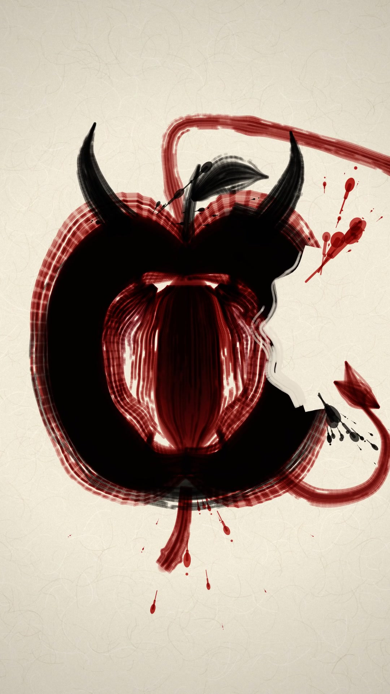
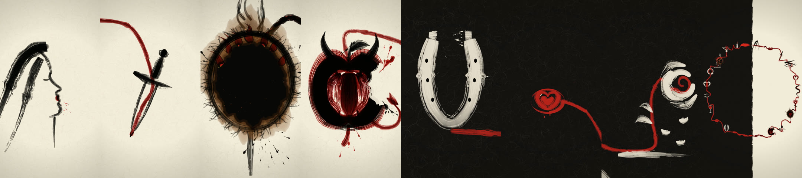

# 🖌️ Don't Call It Magic — клип тушью

**Клип тушью по свитку. Ни одного кадра видеогенерации: всё нарисовано кодом, и через весь клип тянется одна непрерывная красная нить.**

[](docs/magic.mp4)

<p align="center"><b><a href="docs/magic.mp4">▶ Смотреть клип</a></b> · автор — Андрей Овчаренко · <a href="https://t.me/Amovcharenko">tg @Amovcharenko</a> · <b><a href="https://t.me/andreydraft">📣 канал @andreydraft</a></b></p>

---

## 💡 Идея

Весь клип — это одна нить-кисть. Красная линия помады выходит из губ девушки в профиль и больше ни разу не отрывается от бумаги: становится лезвием кинжала, радужкой глаза, сердцем, змеёй, стеблем розы, фитилём, арканом. Камера идёт за кончиком кисти по огромному свитку, останавливается на образе и едет дальше, как при разворачивании эмаки. Образы не сменяют друг друга склейкой, а вырастают друг из друга и остаются на бумаге.

Первая половина песни идёт по светлой бумаге, вторая — по залитой тушью. В финале камера отъезжает на всю картину: все образы оказываются бусинами на одном незамкнутом круге-энсо, а нить приходит ровно в свою первую точку, и клип закольцовывается.



## 🎵 Звук

- Трек — [«Don't Call It Magic» (Burn the Veil)](https://suno.com/song/727bddc1-5e0b-4402-937a-c1dc44605c8e), сделан в Suno
- Картинка идёт по тексту припева: *You can burn me / Curse me / Break me down / Then bury me in the ground / But don't call it magic* — спичка прожигает свиток, тушь расползается по волокнам, клякса, могила, яблоко «guilty pleasure»

## 🎨 Визуал

- **Кисть из щетинок.** Каждый мазок — пучок из десятков отдельных волосков со своим запасом туши; к концу мазка кисть высыхает и рвётся на сухие штрихи. Сверху — мокрый подтёк, на сильных долях мазок набирает давление и бросает брызги
- **Тушь и бумага.** Васи с волокнами, тушь ложится умножением; на чёрной половине та же кисть пишет светлым гофуном. Красный — киноварь и помада
- **Холст 12000×12000.** Весь клип нарисован на одном мировом холсте: круг радиусом 5000 px, по которому идут 20 станций-образов. Холст режется на тайлы 1080×1920 с запечённой бумагой и тушью, для дальних планов есть обзорная копия
- **Камера-свиток.** Стоит на образе, едет за кончиком кисти к следующему, толкается вперёд на ударах; в конце — один медленный отъезд на всю картину
- **Синхрон.** Сетка битов, сильных долей и ударов лежит в [`assets/timing.json`](assets/timing.json); моменты слов вшиты в сцену временами мазков. Каждый мазок приходит массой на свою долю или слово
- **Рендер** — headless Chrome кадр за кадром, 1080×1920, 24 fps, ffmpeg

## 🚧 Самое трудное

Держать цельность одной линии. Как только образ рисуется отдельно, а нить просто подводит к нему, клип превращается в слайд-шоу. Поэтому каждый образ строится вокруг нити: нить — край лезвия, ось змеи, стебель, фитиль, петля аркана.

Финальный отъезд. Камера проходит путь от крупного плана до всего холста за несколько секунд, и любая смена масштаба или переход с тайлов на обзорную копию видны как рывок или прыжок толщины линии. В итоге отъезд идёт с постоянной скоростью в логарифме зума, а тайлы и обзор плавно перетекают друг в друга.

## Что внутри

| Путь | Что это |
|---|---|
| [`index.html`](index.html) | Страница с канвасом 1080×1920 |
| [`sumi.js`](sumi.js) | Весь клип: кисть, бумага, образы, камера, финал |
| [`assets/timing.json`](assets/timing.json) | Длительность, биты, сильные доли, удары |
| [`assets/magic.m4a`](assets/magic.m4a) | Трек (с секундой тишины в конце) |
| [`render.mjs`](render.mjs) | Рендер кадров в headless Chrome и сборка MP4 через ffmpeg |
| [`docs/`](docs/) | Постер, лента кадров и клип 720×1280 |

## Рендер

Нужны Node.js, Google Chrome и ffmpeg. Chrome берётся из `/Applications`; в другом месте — укажи путь в `CHROME=...`.

```bash
npm install
node render.mjs --sheet   # контакт-лист из 6 кадров -> out/sheet.png
node render.mjs           # весь клип -> out/magic.mp4 (1080×1920, 24 fps, со звуком)
```

Посмотреть вживую: `python3 -m http.server 8000`, открыть `http://localhost:8000/` и в консоли вызвать `frame(57.5)` — страница нарисует кадр на любой секунде.

---

⭐ Понравилось — поставь звезду репе, это лучший способ сказать спасибо. Больше таких экспериментов — в телеграм-канале **[@andreydraft](https://t.me/andreydraft)**.
